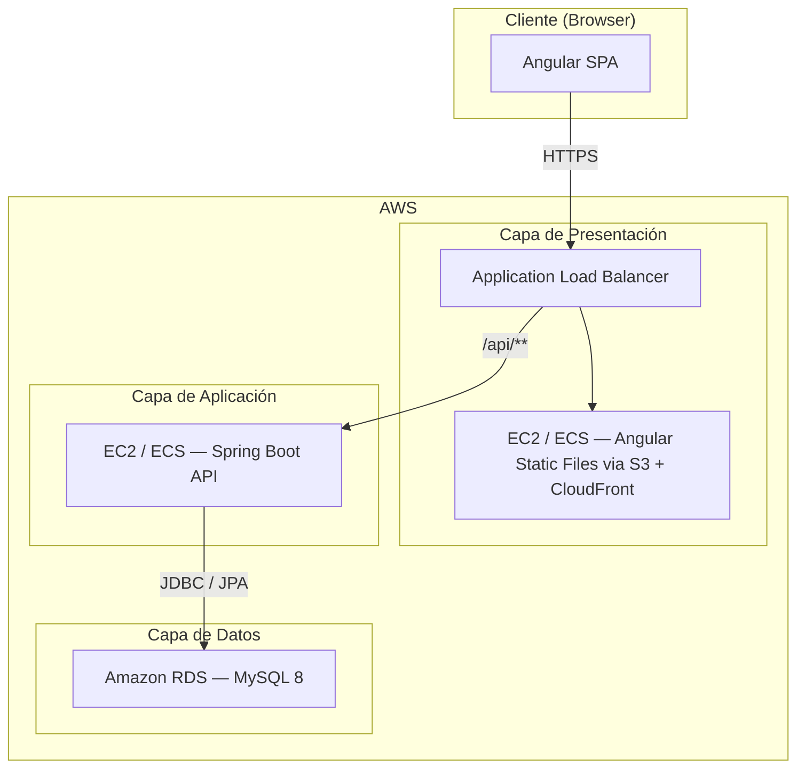
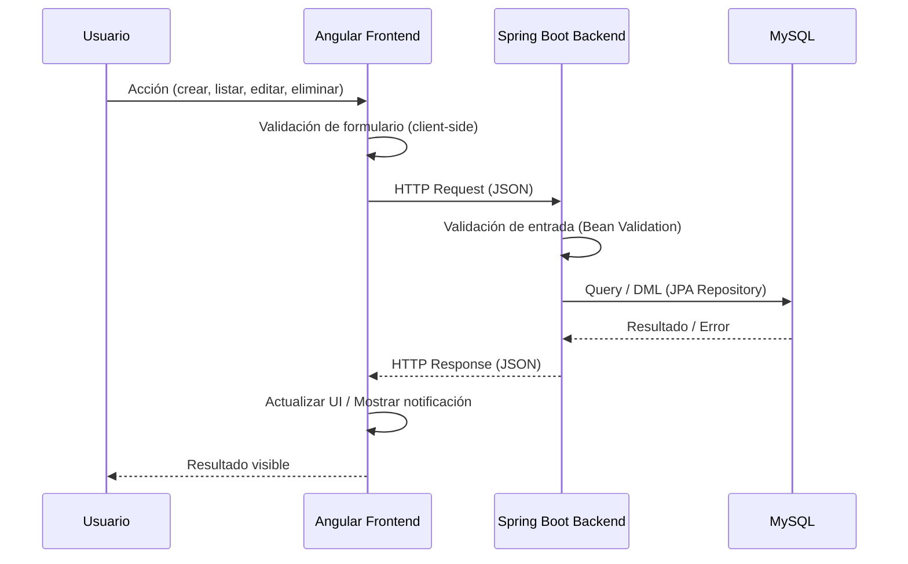
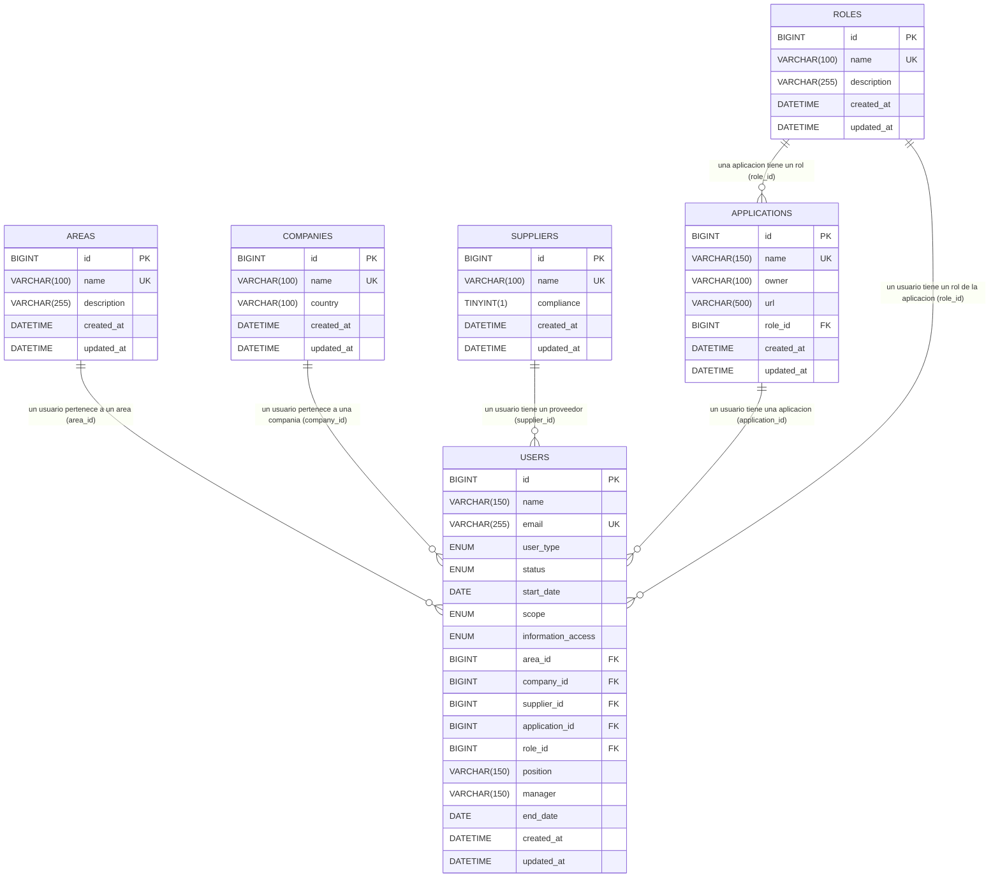

# Documento de Diseño Técnico — Matriz de Usuarios

## Descripción General (Overview)

**Matriz de Usuarios** es una aplicación web empresarial que centraliza el inventario de aplicaciones corporativas y los catálogos de soporte (Roles, Áreas, Compañías, Proveedores) junto con la gestión completa de usuarios. El sistema expone seis módulos con operaciones CRUD completas, paginación, búsqueda y manejo de errores consistente.

### Objetivos de diseño

- Proveer una API REST uniforme y predecible para todos los módulos.
- Garantizar integridad referencial entre entidades mediante restricciones en la base de datos y validaciones en el backend.
- Ofrecer una interfaz Angular reactiva con formularios validados, tablas paginadas y notificaciones de error.
- Desplegar en AWS con alta disponibilidad y separación de responsabilidades entre capas.

### Stack tecnológico

| Capa | Tecnología | Versión mínima |
|---|---|---|
| Frontend | Angular | 17 |
| Backend | Spring Boot | 3.x |
| Base de datos | MySQL | 8.0 |
| Infraestructura | AWS (EC2 / RDS / ALB) | — |
| ORM | Spring Data JPA / Hibernate | 6.x |
| Migraciones DB | Flyway | 9.x |
| Documentación API | SpringDoc OpenAPI (Swagger UI) | 2.x |

---

## Arquitectura

### Diagrama de capas



### Flujo de una petición típica



### Principios arquitectónicos

- **Separación de capas**: Controller → Service → Repository. Ninguna capa salta a otra no adyacente.
- **Stateless API**: El backend no mantiene estado de sesión; cada petición es autónoma.
- **Fail-fast validation**: Las validaciones de formato y campos requeridos se ejecutan antes de tocar la base de datos.
- **Transaccionalidad explícita**: Todas las operaciones de escritura que involucren múltiples tablas se envuelven en una transacción `@Transactional`.

---

## Componentes e Interfaces

### Backend — Estructura de paquetes

```
com.empresa.appinventory
├── config/                  # Configuración Spring (CORS, OpenAPI, etc.)
├── exception/               # GlobalExceptionHandler, clases de error
├── common/
│   ├── dto/                 # PagedResponse<T>, ErrorResponse
│   └── validation/          # Anotaciones de validación personalizadas
├── module/
│   ├── application/         # ApplicationController, ApplicationService, ApplicationRepository, ApplicationEntity, ApplicationDTO
│   ├── role/                # RoleController, RoleService, RoleRepository, RoleEntity, RoleDTO
│   ├── area/                # AreaController, AreaService, AreaRepository, AreaEntity, AreaDTO
│   ├── company/             # CompanyController, CompanyService, CompanyRepository, CompanyEntity, CompanyDTO
│   ├── supplier/            # SupplierController, SupplierService, SupplierRepository, SupplierEntity, SupplierDTO
│   └── user/                # UserController, UserService, UserRepository, UserEntity, UserDTO
```

### API REST — Endpoints

Todos los endpoints siguen el patrón `/api/v1/{recurso}`.

#### Patrón uniforme por módulo

| Método | Ruta | Descripción | Código éxito |
|---|---|---|---|
| GET | `/api/v1/{recurso}?page=0&size=20&search=` | Listar con paginación y búsqueda | 200 |
| GET | `/api/v1/{recurso}/{id}` | Obtener detalle | 200 |
| POST | `/api/v1/{recurso}` | Crear registro | 201 |
| PUT | `/api/v1/{recurso}/{id}` | Actualizar registro completo | 200 |
| DELETE | `/api/v1/{recurso}/{id}` | Eliminar registro | 204 |

#### Recursos disponibles

| Recurso | Ruta base |
|---|---|
| Inventario de Aplicaciones | `/api/v1/applications` |
| Catálogo de Roles | `/api/v1/roles` |
| Catálogo de Áreas | `/api/v1/areas` |
| Catálogo de Compañías | `/api/v1/companies` |
| Catálogo de Proveedores | `/api/v1/suppliers` |
| Módulo de Usuarios | `/api/v1/users` |

#### Endpoint adicional: Roles por aplicación

| Método | Ruta | Descripción | Código éxito |
|---|---|---|---|
| GET | `/api/v1/applications/{id}/roles` | Retorna la lista de roles asociados a una aplicación específica (para el dropdown dependiente del frontend) | 200 |

Este endpoint es consumido por el `UserFormComponent` del frontend para poblar dinámicamente el dropdown de roles una vez que el usuario selecciona una aplicación.

#### Estructura de respuesta de listado paginado

```json
{
  "content": [...],
  "totalElements": 150,
  "totalPages": 8,
  "currentPage": 0,
  "pageSize": 20
}
```

#### Estructura de respuesta de error

```json
{
  "timestamp": "2024-01-15T10:30:00Z",
  "status": 400,
  "error": "Bad Request",
  "message": "El nombre de la aplicación ya existe",
  "path": "/api/v1/applications"
}
```

Para errores de validación con múltiples campos:

```json
{
  "timestamp": "2024-01-15T10:30:00Z",
  "status": 400,
  "error": "Validation Failed",
  "fields": {
    "name": "El nombre es requerido",
    "url": "La URL proporcionada no tiene un formato válido"
  },
  "path": "/api/v1/applications"
}
```

### Frontend — Estructura de módulos Angular

```
src/app/
├── core/
│   ├── interceptors/        # HttpErrorInterceptor, LoadingInterceptor
│   ├── services/            # NotificationService, LoadingService
│   └── models/              # Interfaces TypeScript compartidas
├── shared/
│   ├── components/
│   │   ├── data-table/      # Tabla paginada reutilizable
│   │   ├── confirm-dialog/  # Diálogo de confirmación para eliminaciones
│   │   └── notification/    # Componente de notificaciones (toast)
│   └── validators/          # Validadores reactivos personalizados
├── modules/
│   ├── applications/        # ApplicationListComponent, ApplicationFormComponent
│   ├── roles/               # RoleListComponent, RoleFormComponent
│   ├── areas/               # AreaListComponent, AreaFormComponent
│   ├── companies/           # CompanyListComponent, CompanyFormComponent
│   ├── suppliers/           # SupplierListComponent, SupplierFormComponent
│   └── users/               # UserListComponent, UserFormComponent
└── app-routing.module.ts
```

#### Componente `DataTableComponent` (reutilizable)

Acepta como inputs:
- `columns: ColumnDef[]` — definición de columnas
- `dataSource$: Observable<PagedResponse<T>>` — fuente de datos
- `pageSize: number` — tamaño de página inicial
- `searchable: boolean` — habilitar campo de búsqueda

Emite como outputs:
- `pageChange: EventEmitter<PageEvent>`
- `searchChange: EventEmitter<string>`
- `editAction: EventEmitter<T>`
- `deleteAction: EventEmitter<T>`

#### `HttpErrorInterceptor`

Intercepta todas las respuestas HTTP con error y:
1. Extrae el mensaje del cuerpo JSON de error.
2. Despacha una notificación al `NotificationService`.
3. Re-lanza el error para que el componente pueda reaccionar si es necesario.

#### `LoadingInterceptor`

Activa/desactiva el estado de carga global en `LoadingService` para cada petición HTTP en vuelo, lo que permite deshabilitar botones de envío.

#### `UserFormComponent` — Dropdown dependiente de roles

El formulario de alta/modificación de usuarios implementa un dropdown en cascada para la selección de aplicación y rol:

1. **Dropdown de aplicación**: Se puebla al cargar el componente con `GET /api/v1/applications` (lista completa de aplicaciones registradas).
2. **Dropdown de rol (dependiente)**: Permanece deshabilitado hasta que el usuario selecciona una aplicación.
3. **Al seleccionar una aplicación**: El componente llama a `GET /api/v1/applications/{id}/roles` y puebla el dropdown de roles únicamente con los roles asociados a esa aplicación.
4. **Al cambiar la aplicación seleccionada**: El campo de rol se resetea a `null` y el dropdown de roles se repuebla con los roles de la nueva aplicación.
5. **Ambos campos son opcionales**: Si el usuario no selecciona aplicación, el campo de rol permanece deshabilitado y ambos se envían como `null` al backend.

```typescript
// Fragmento ilustrativo del comportamiento reactivo
this.form.get('applicationId')!.valueChanges.subscribe(appId => {
  this.form.get('roleId')!.reset(null);
  if (appId) {
    this.applicationService.getRolesByApplication(appId).subscribe(roles => {
      this.availableRoles = roles;
      this.form.get('roleId')!.enable();
    });
  } else {
    this.availableRoles = [];
    this.form.get('roleId')!.disable();
  }
});
```

---

## Modelos de Datos

### Diagrama Entidad-Relación



### Scripts DDL (Flyway migration V1)

```sql
CREATE TABLE roles (
    id          BIGINT AUTO_INCREMENT PRIMARY KEY,
    name        VARCHAR(100) NOT NULL,
    description VARCHAR(255),
    created_at  DATETIME NOT NULL DEFAULT CURRENT_TIMESTAMP,
    updated_at  DATETIME NOT NULL DEFAULT CURRENT_TIMESTAMP ON UPDATE CURRENT_TIMESTAMP,
    CONSTRAINT uk_roles_name UNIQUE (name)
);

CREATE TABLE areas (
    id          BIGINT AUTO_INCREMENT PRIMARY KEY,
    name        VARCHAR(100) NOT NULL,
    description VARCHAR(255),
    created_at  DATETIME NOT NULL DEFAULT CURRENT_TIMESTAMP,
    updated_at  DATETIME NOT NULL DEFAULT CURRENT_TIMESTAMP ON UPDATE CURRENT_TIMESTAMP,
    CONSTRAINT uk_areas_name UNIQUE (name)
);

CREATE TABLE companies (
    id          BIGINT AUTO_INCREMENT PRIMARY KEY,
    name        VARCHAR(100) NOT NULL,
    country     VARCHAR(100) NOT NULL,
    created_at  DATETIME NOT NULL DEFAULT CURRENT_TIMESTAMP,
    updated_at  DATETIME NOT NULL DEFAULT CURRENT_TIMESTAMP ON UPDATE CURRENT_TIMESTAMP,
    CONSTRAINT uk_companies_name UNIQUE (name)
);

CREATE TABLE suppliers (
    id          BIGINT AUTO_INCREMENT PRIMARY KEY,
    name        VARCHAR(100) NOT NULL,
    compliance  TINYINT(1) NOT NULL DEFAULT 0,
    created_at  DATETIME NOT NULL DEFAULT CURRENT_TIMESTAMP,
    updated_at  DATETIME NOT NULL DEFAULT CURRENT_TIMESTAMP ON UPDATE CURRENT_TIMESTAMP,
    CONSTRAINT uk_suppliers_name UNIQUE (name)
);

CREATE TABLE applications (
    id          BIGINT AUTO_INCREMENT PRIMARY KEY,
    name        VARCHAR(150) NOT NULL,
    owner       VARCHAR(100) NOT NULL,
    url         VARCHAR(500) NOT NULL,
    role_id     BIGINT NOT NULL,
    created_at  DATETIME NOT NULL DEFAULT CURRENT_TIMESTAMP,
    updated_at  DATETIME NOT NULL DEFAULT CURRENT_TIMESTAMP ON UPDATE CURRENT_TIMESTAMP,
    CONSTRAINT uk_applications_name UNIQUE (name),
    CONSTRAINT fk_applications_role FOREIGN KEY (role_id) REFERENCES roles(id)
);

CREATE TABLE users (
    id                 BIGINT AUTO_INCREMENT PRIMARY KEY,
    name               VARCHAR(150) NOT NULL,
    email              VARCHAR(255) NOT NULL,
    user_type          ENUM('Interno','Practicante','Contractor') NOT NULL,
    status             ENUM('ACTIVO','INACTIVO') NOT NULL,
    start_date         DATE NOT NULL,
    scope              ENUM('PCI','ISO','General') NOT NULL,
    information_access ENUM('Secreta','Confidencial','Uso Interno') NOT NULL,
    area_id            BIGINT,
    company_id         BIGINT,
    supplier_id        BIGINT,
    application_id     BIGINT,
    role_id            BIGINT,
    position           VARCHAR(150),
    manager            VARCHAR(150),
    end_date           DATE,
    created_at         DATETIME NOT NULL DEFAULT CURRENT_TIMESTAMP,
    updated_at         DATETIME NOT NULL DEFAULT CURRENT_TIMESTAMP ON UPDATE CURRENT_TIMESTAMP,
    CONSTRAINT uk_users_email      UNIQUE (email),
    CONSTRAINT fk_users_area       FOREIGN KEY (area_id)        REFERENCES areas(id),
    CONSTRAINT fk_users_company    FOREIGN KEY (company_id)     REFERENCES companies(id),
    CONSTRAINT fk_users_supplier   FOREIGN KEY (supplier_id)    REFERENCES suppliers(id),
    CONSTRAINT fk_users_application FOREIGN KEY (application_id) REFERENCES applications(id),
    CONSTRAINT fk_users_role       FOREIGN KEY (role_id)        REFERENCES roles(id)
);
```

### DTOs principales (Backend)

#### `ApplicationRequestDTO`

```java
public record ApplicationRequestDTO(
    @NotBlank String name,
    @NotBlank String owner,
    @NotBlank @URL String url,
    @NotNull Long roleId
) {}
```

#### `ApplicationResponseDTO`

```java
public record ApplicationResponseDTO(
    Long id,
    String name,
    String owner,
    String url,
    Long roleId,
    String roleName
) {}
```

#### `UserRequestDTO`

```java
public record UserRequestDTO(
    @NotBlank String name,
    @NotBlank @Email String email,
    @NotNull UserType userType,
    @NotNull UserStatus status,
    @NotNull LocalDate startDate,
    @NotNull Scope scope,
    @NotNull InformationAccess informationAccess,
    Long areaId,
    Long companyId,
    Long supplierId,
    Long applicationId,
    Long roleId,
    String position,
    String manager,
    LocalDate endDate
) {}
```

#### `UserResponseDTO`

```java
public record UserResponseDTO(
    Long id,
    String name,
    String email,
    UserType userType,
    UserStatus status,
    LocalDate startDate,
    Scope scope,
    InformationAccess informationAccess,
    Long areaId,
    String areaName,
    Long companyId,
    String companyName,
    Long supplierId,
    String supplierName,
    Long applicationId,
    String applicationName,
    Long roleId,
    String roleName,
    String position,
    String manager,
    LocalDate endDate
) {}
```

#### `PagedResponseDTO<T>`

```java
public record PagedResponseDTO<T>(
    List<T> content,
    long totalElements,
    int totalPages,
    int currentPage,
    int pageSize
) {}
```

### Enumeraciones (Java)

```java
public enum UserType { Interno, Practicante, Contractor }
public enum UserStatus { ACTIVO, INACTIVO }
public enum Scope { PCI, ISO, General }
public enum InformationAccess { Secreta, Confidencial, Uso_Interno }
```

---

## Propiedades de Corrección

*Una propiedad es una característica o comportamiento que debe ser verdadero en todas las ejecuciones válidas del sistema — esencialmente, una declaración formal sobre lo que el sistema debe hacer. Las propiedades sirven como puente entre las especificaciones legibles por humanos y las garantías de corrección verificables por máquinas.*

### Propiedad 1: Round-trip de creación en catálogos

*Para cualquier* catálogo (Roles, Áreas, Compañías, Proveedores) y cualquier conjunto válido de campos (nombre único, descripción), crear un registro y luego consultarlo por su ID debe retornar exactamente los mismos datos que se enviaron en la creación.

**Valida: Requerimientos 3.1, 3.2, 3.3, 4.1, 4.2, 4.3, 5.1, 5.2, 5.3, 6.1, 6.2, 6.3**

---

### Propiedad 2: Unicidad de nombres en catálogos

*Para cualquier* catálogo y cualquier nombre de registro ya existente en ese catálogo, intentar crear un segundo registro con el mismo nombre (independientemente de mayúsculas/minúsculas o espacios adicionales) debe resultar en un error de validación y el catálogo debe permanecer sin cambios.

**Valida: Requerimientos 2.6, 3.5, 4.5, 5.5, 6.5**

---

### Propiedad 3: Integridad referencial al eliminar entidades referenciadas

*Para cualquier* entidad de catálogo (Rol, Área, Compañía, Proveedor, Aplicación) que tenga al menos un registro dependiente (Aplicación o Usuario), intentar eliminarla debe retornar HTTP 409 y la entidad debe seguir existiendo en la base de datos. Esto incluye el caso en que una Aplicación esté referenciada por al menos un Usuario a través del campo `application_id`.

**Valida: Requerimientos 2.9, 3.6, 4.6, 5.6, 6.6, 10.3**

---

### Propiedad 4: Round-trip de creación de aplicaciones con resolución de rol

*Para cualquier* aplicación creada con un nombre único, owner, URL válida y roleId existente, consultarla por su ID debe retornar todos los campos originales más el nombre del rol resuelto (no solo el ID).

**Valida: Requerimientos 2.1, 2.3, 2.4**

---

### Propiedad 5: Rechazo de URLs inválidas en aplicaciones

*Para cualquier* string que no sea una URL bien formada (que no comience con `http://` o `https://` o que contenga caracteres inválidos), intentar crear o actualizar una aplicación con ese valor en el campo URL debe retornar HTTP 400 con el mensaje de error correspondiente.

**Valida: Requerimiento 2.8**

---

### Propiedad 6: Round-trip de creación de usuarios con resolución de referencias

*Para cualquier* usuario creado con campos obligatorios válidos y referencias opcionales a Área, Compañía y/o Proveedor existentes, consultarlo por su ID debe retornar todos los campos originales más los nombres resueltos de las entidades referenciadas.

**Valida: Requerimientos 7.1, 7.2, 7.4, 7.5**

---

### Propiedad 7: Rechazo de valores de enumeración inválidos en usuarios

*Para cualquier* string que no pertenezca al conjunto de valores válidos de un campo enumerado (`user_type`, `status`, `scope`, `information_access`), intentar crear o actualizar un usuario con ese valor debe retornar HTTP 400.

**Valida: Requerimientos 7.7, 7.8, 7.9, 7.10**

---

### Propiedad 8: Validación de rango de fechas en usuarios

*Para cualquier* par de fechas (fechaAlta, fechaBaja) donde fechaBaja es anterior a fechaAlta, intentar crear o actualizar un usuario con ese par debe retornar HTTP 400 con el mensaje "La fecha de baja no puede ser anterior a la fecha de alta".

**Valida: Requerimiento 7.16**

---

### Propiedad 9: Consistencia de metadatos de paginación

*Para cualquier* endpoint de listado, cualquier dataset de N registros y cualquier combinación válida de parámetros `page` y `size`, los metadatos retornados (`totalElements`, `totalPages`, `currentPage`, `pageSize`) deben ser matemáticamente consistentes entre sí y con el número de elementos en `content`. En particular: `totalPages = ceil(totalElements / pageSize)` y `content.size() <= pageSize`.

**Valida: Requerimientos 8.1, 8.2, 8.5**

---

### Propiedad 10: Corrección del filtro de búsqueda por nombre

*Para cualquier* endpoint de listado con parámetro `search=T`, todos los registros retornados en `content` deben contener la cadena T en su campo `name` de forma case-insensitive, y ningún registro cuyo nombre no contenga T debe aparecer en los resultados.

**Valida: Requerimiento 8.3**

---

### Propiedad 11: Mapeo consistente de errores HTTP

*Para cualquier* petición al backend:
- Si faltan campos requeridos → HTTP 400 con lista de campos faltantes.
- Si el ID del recurso no existe → HTTP 404 con mensaje descriptivo.
- Si se viola una restricción de integridad referencial → HTTP 409 con mensaje descriptivo.

*Para ninguna* de estas condiciones el backend debe retornar HTTP 200 ni exponer detalles internos de implementación (stack traces, nombres de clases).

**Valida: Requerimientos 9.1, 9.2, 9.3**

---

### Propiedad 12: Atomicidad de transacciones multi-tabla

*Para cualquier* operación de escritura que involucre múltiples tablas, si alguna operación individual dentro de la transacción falla, entonces ningún cambio parcial debe persistir en la base de datos (el estado de la DB debe ser idéntico al estado previo a la operación).

**Valida: Requerimiento 10.7**

---

### Propiedad 13: Consistencia de rol-aplicación en usuarios

*Para cualquier* usuario creado o actualizado con un `applicationId` y un `roleId`, el `roleId` debe pertenecer a los roles asociados a la `applicationId` seleccionada; si el rol no pertenece a esa aplicación, el sistema debe retornar HTTP 400 con el mensaje "El rol especificado no pertenece a la aplicación seleccionada". Si se proporciona `roleId` sin `applicationId`, el sistema debe retornar HTTP 400.

**Valida: Requerimientos 7.21, 7.22, 7.23**

---

## Manejo de Errores

### Jerarquía de excepciones (Backend)

```
AppException (base)
├── ResourceNotFoundException      → HTTP 404
├── DuplicateResourceException     → HTTP 400
├── ReferentialIntegrityException  → HTTP 409
├── ValidationException            → HTTP 400
└── ServiceUnavailableException    → HTTP 503
```

### `GlobalExceptionHandler` (`@RestControllerAdvice`)

| Excepción capturada | Código HTTP | Comportamiento |
|---|---|---|
| `ResourceNotFoundException` | 404 | Mensaje del constructor de la excepción |
| `DuplicateResourceException` | 400 | Mensaje de unicidad específico del módulo |
| `ReferentialIntegrityException` | 409 | Mensaje de integridad referencial específico |
| `MethodArgumentNotValidException` | 400 | Mapa de campo → mensaje de error |
| `DataAccessException` (DB no disponible) | 503 | "El servicio no está disponible temporalmente" |
| `Exception` (catch-all) | 500 | "Ha ocurrido un error interno. Por favor contacte al administrador." |

### Validaciones de negocio por módulo

| Módulo | Validación | Mensaje |
|---|---|---|
| Application | Nombre duplicado | "El nombre de la aplicación ya existe" |
| Application | Rol inexistente | "El rol especificado no existe" |
| Application | URL inválida | "La URL proporcionada no tiene un formato válido" |
| Application / Role | Rol en uso al eliminar | "El rol está en uso y no puede eliminarse" |
| Application | Aplicación en uso por usuario al eliminar | "La aplicación está en uso y no puede eliminarse" |
| Role | Nombre duplicado | "El nombre del rol ya existe" |
| Area | Nombre duplicado | "El nombre del área ya existe" |
| Area | Área en uso al eliminar | "El área está en uso y no puede eliminarse" |
| Company | Nombre duplicado | "El nombre de la compañía ya existe" |
| Company | Compañía en uso al eliminar | "La compañía está en uso y no puede eliminarse" |
| Supplier | Nombre duplicado | "El nombre del proveedor ya existe" |
| Supplier | Proveedor en uso al eliminar | "El proveedor está en uso y no puede eliminarse" |
| User | Email inválido | "El correo electrónico no tiene un formato válido" |
| User | Email duplicado | "El correo electrónico ya está registrado" |
| User | Área inexistente | "El área especificada no existe" |
| User | Compañía inexistente | "La compañía especificada no existe" |
| User | Proveedor inexistente | "El proveedor especificado no existe" |
| User | Aplicación inexistente | "La aplicación especificada no existe" |
| User | Rol no pertenece a la aplicación | "El rol especificado no pertenece a la aplicación seleccionada" |
| User | Fecha de baja anterior a alta | "La fecha de baja no puede ser anterior a la fecha de alta" |

### Manejo de errores en el Frontend

1. `HttpErrorInterceptor` captura todas las respuestas con status >= 400.
2. Extrae el campo `message` (o `fields` para errores de validación) del cuerpo JSON.
3. Invoca `NotificationService.showError(message)` para mostrar un toast visible.
4. Para errores 400 con `fields`, muestra los errores inline en los campos del formulario reactivo.
5. `LoadingInterceptor` activa `isLoading = true` al inicio de cada petición y `isLoading = false` al completarse, lo que deshabilita el botón de envío mediante `[disabled]="isLoading"`.

---

## Estrategia de Pruebas

### Enfoque dual: pruebas unitarias + pruebas basadas en propiedades

El sistema utiliza dos tipos complementarios de pruebas:

- **Pruebas unitarias / de ejemplo**: verifican comportamientos específicos, casos borde y condiciones de error con datos concretos.
- **Pruebas basadas en propiedades (PBT)**: verifican propiedades universales a través de cientos de inputs generados aleatoriamente.

### Herramientas

| Capa | Framework de pruebas | Librería PBT |
|---|---|---|
| Backend (Java) | JUnit 5 + Mockito | [jqwik](https://jqwik.net/) |
| Frontend (TypeScript) | Jest + Angular Testing Library | [fast-check](https://fast-check.dev/) |
| Integración | Testcontainers (MySQL) | — |

### Pruebas unitarias (Backend)

- **Service layer**: Mockear repositorios con Mockito. Cubrir flujos felices y todos los casos de error de negocio.
- **Controller layer**: Usar `MockMvc` para verificar serialización JSON, códigos HTTP y manejo de errores.
- **Validaciones**: Verificar que Bean Validation rechaza inputs inválidos con los mensajes correctos.

Ejemplos de casos a cubrir:
- Crear aplicación con rol inexistente → `ResourceNotFoundException` → HTTP 404.
- Crear usuario con email duplicado → `DuplicateResourceException` → HTTP 400.
- Eliminar área referenciada por usuario → `ReferentialIntegrityException` → HTTP 409.
- Consultar recurso con ID inexistente → HTTP 404.
- DB no disponible → HTTP 503.

### Pruebas basadas en propiedades (Backend — jqwik)

Cada propiedad del diseño se implementa como un test `@Property` con mínimo **100 iteraciones**.

Cada test debe incluir un comentario de trazabilidad:

```java
// Feature: app-inventory-management, Property N: <texto de la propiedad>
```

| Propiedad | Test jqwik |
|---|---|
| P1: Round-trip catálogos | Generar `RoleDTO` aleatorio con nombre único → POST → GET by ID → assertEquals |
| P2: Unicidad de nombres | Generar nombre existente → POST duplicado → assertThrows DuplicateResourceException |
| P3: Integridad referencial | Crear rol con aplicación → DELETE rol → assertThrows ReferentialIntegrityException |
| P4: Round-trip aplicaciones | Generar `ApplicationDTO` válido → POST → GET → assertEquals incluyendo roleName |
| P5: Rechazo de URLs inválidas | Generar strings no-URL → POST application → assert HTTP 400 |
| P6: Round-trip usuarios | Generar `UserDTO` válido con referencias → POST → GET → assertEquals con nombres resueltos |
| P7: Enums inválidos | Generar strings fuera del enum → POST user → assert HTTP 400 |
| P8: Fechas inválidas | Generar (startDate, endDate) donde endDate < startDate → POST user → assert HTTP 400 |
| P9: Consistencia de paginación | Generar N registros y parámetros page/size → GET list → assert metadatos consistentes |
| P10: Filtro de búsqueda | Generar dataset y término de búsqueda → GET list?search=T → assert todos los resultados contienen T |
| P11: Mapeo de errores HTTP | Generar peticiones inválidas de cada tipo → assert código HTTP correcto |
| P12: Atomicidad | Simular fallo en operación multi-tabla → assert estado DB sin cambios |
| P13: Consistencia rol-aplicación | Generar usuarios con roleId que no pertenece a applicationId → assert HTTP 400; generar usuarios con roleId válido para applicationId → assert creación exitosa |

### Pruebas de integración (Testcontainers)

- Levantar MySQL 8 en contenedor Docker para pruebas de integración.
- Verificar que las migraciones Flyway se aplican correctamente.
- Verificar restricciones de unicidad y claves foráneas a nivel de DB.
- Verificar que `@Transactional` revierte cambios parciales ante fallo.

### Pruebas de componentes (Frontend — Jest + fast-check)

- **DataTableComponent**: Verificar que renderiza columnas correctas y emite eventos de paginación.
- **Formularios reactivos**: Verificar que el botón de envío se deshabilita con campos inválidos.
- **HttpErrorInterceptor**: Verificar que errores 4xx/5xx disparan notificaciones.
- **PBT con fast-check**: Para la Propiedad 10 (filtro de búsqueda), generar datasets y términos aleatorios y verificar que el componente de tabla solo muestra registros que contienen el término.

### Pruebas de humo (Smoke Tests)

- Verificar versión de Angular ≥ 17 en `package.json`.
- Verificar versión de Spring Boot ≥ 3 en `pom.xml`.
- Verificar conectividad a MySQL 8.
- Verificar que el esquema de DB contiene todas las tablas y restricciones esperadas.

### Cobertura objetivo

| Capa | Cobertura mínima |
|---|---|
| Backend — Service | 85% líneas |
| Backend — Controller | 80% líneas |
| Frontend — Services | 80% líneas |
| Frontend — Components | 70% líneas |
