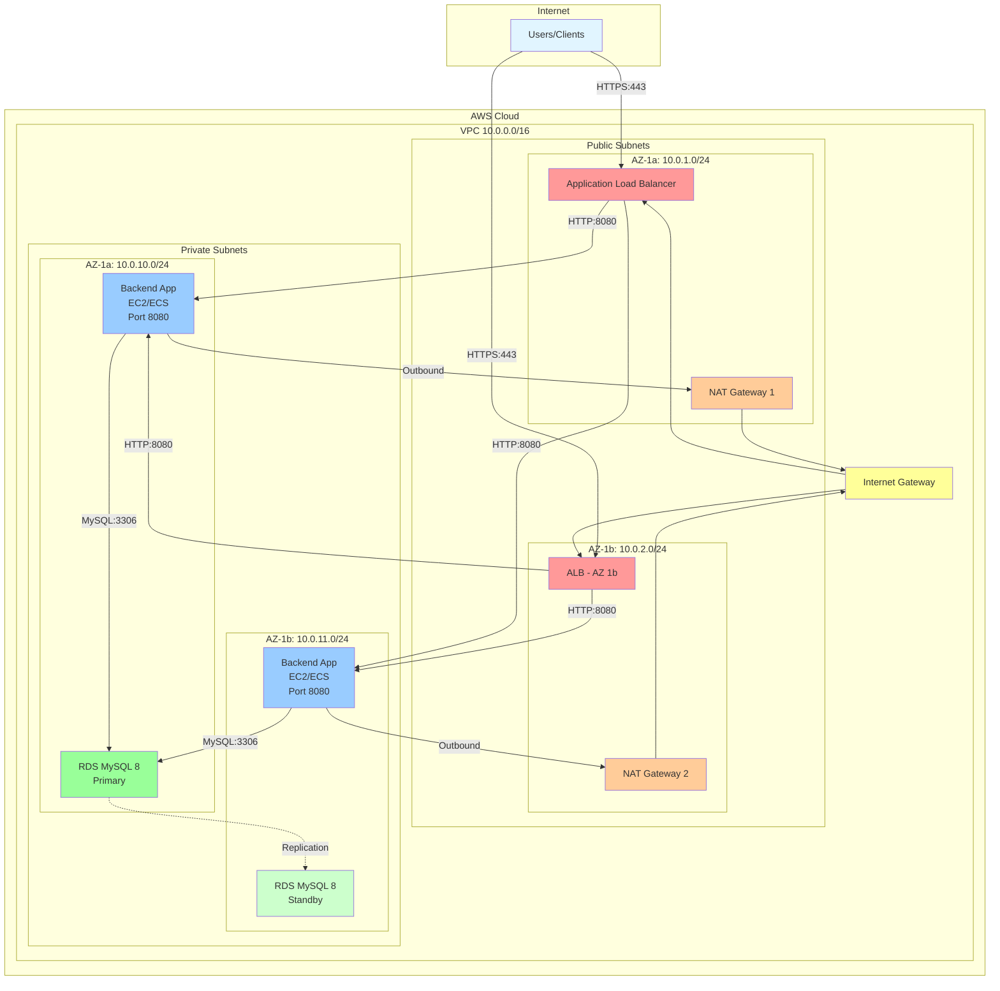
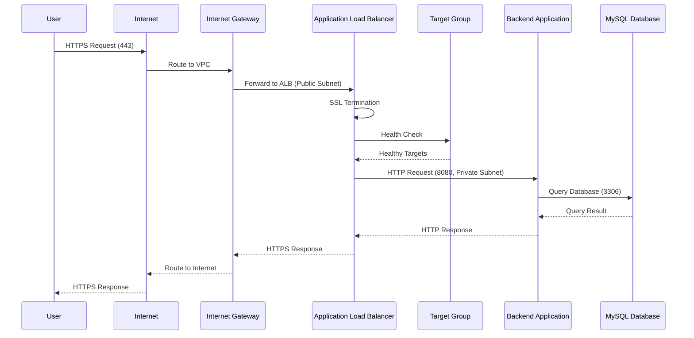
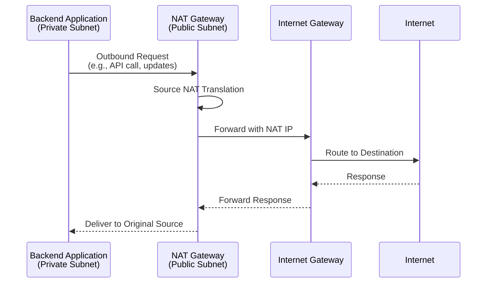
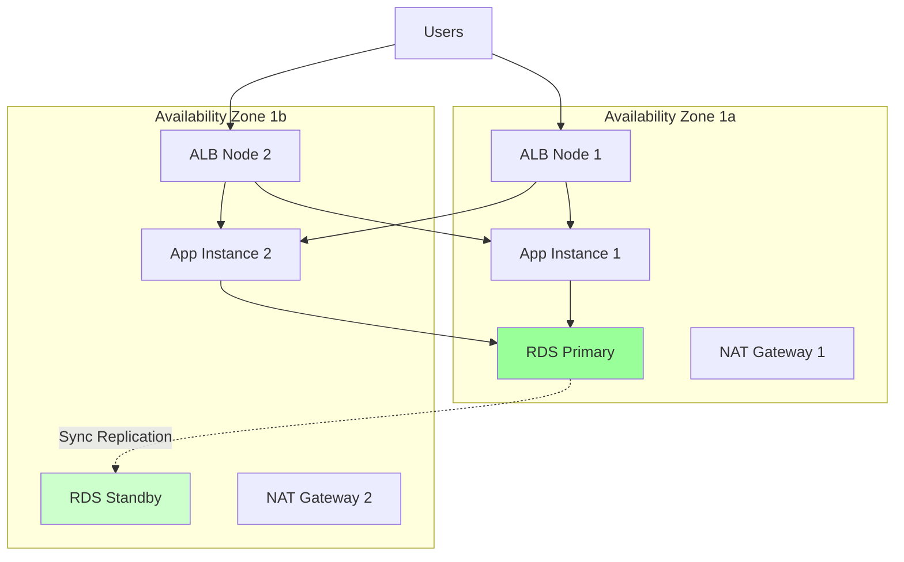
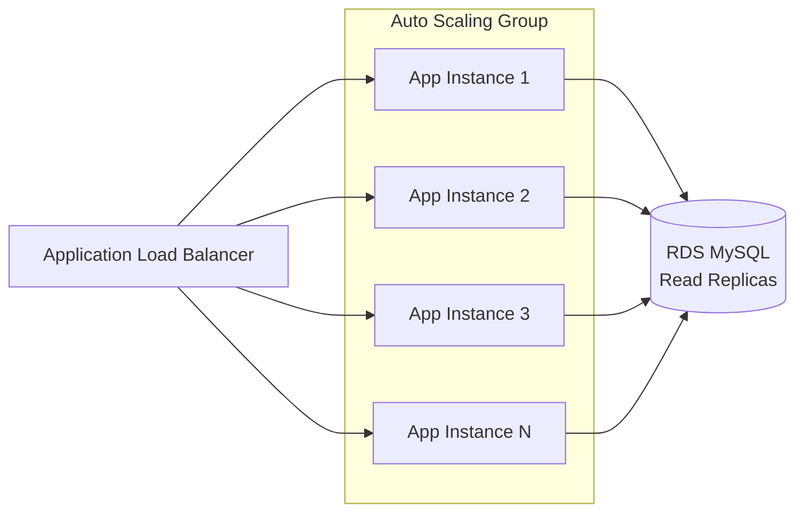
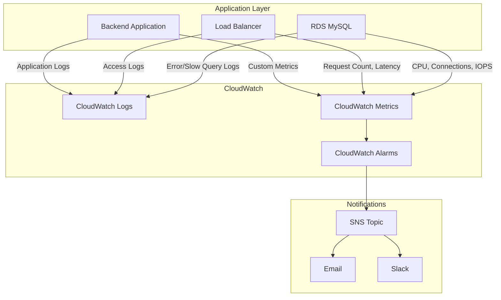
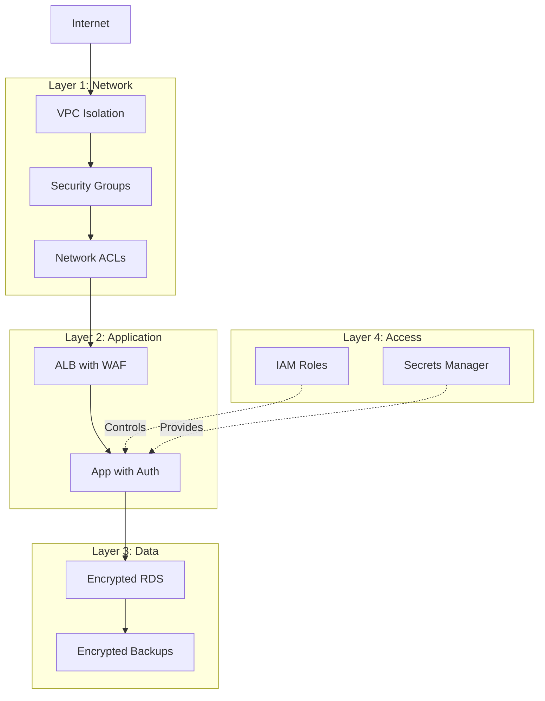

# Infrastructure Architecture - Matriz de Usuarios

## High-Level Architecture Diagram



## Security Group Rules

```mermaid
graph LR
    subgraph "Internet"
        Internet[0.0.0.0/0]
    end

    subgraph "ALB Security Group"
        ALB[ALB<br/>Ingress: 443, 80<br/>Egress: All]
    end

    subgraph "App Security Group"
        APP[Application<br/>Ingress: 8080 from ALB<br/>Egress: All]
    end

    subgraph "RDS Security Group"
        RDS[RDS MySQL<br/>Ingress: 3306 from App<br/>Egress: All]
    end

    Internet -->|HTTPS:443<br/>HTTP:80| ALB
    ALB -->|HTTP:8080| APP
    APP -->|MySQL:3306| RDS

    style Internet fill:#e1f5ff
    style ALB fill:#ff9999
    style APP fill:#99ccff
    style RDS fill:#99ff99
```

## Network Flow

### Inbound Request Flow (User → Backend)



### Outbound Request Flow (Backend → Internet)



## Component Details

### VPC Configuration

| Component | Configuration | Purpose |
|-----------|--------------|---------|
| **VPC CIDR** | 10.0.0.0/16 | Provides 65,536 IP addresses |
| **Public Subnets** | 10.0.1.0/24, 10.0.2.0/24 | 512 IPs for ALB, NAT Gateways |
| **Private Subnets** | 10.0.10.0/24, 10.0.11.0/24 | 512 IPs for apps and RDS |
| **Availability Zones** | 2 (us-east-1a, us-east-1b) | High availability |

### Security Groups

#### ALB Security Group
```
Ingress:
  - Port 443 (HTTPS) from 0.0.0.0/0
  - Port 80 (HTTP) from 0.0.0.0/0
Egress:
  - All traffic to 0.0.0.0/0
```

#### Application Security Group
```
Ingress:
  - Port 8080 (HTTP) from ALB Security Group
Egress:
  - All traffic to 0.0.0.0/0
```

#### RDS Security Group
```
Ingress:
  - Port 3306 (MySQL) from Application Security Group
Egress:
  - All traffic to 0.0.0.0/0
```

### RDS Configuration

| Setting | Value | Notes |
|---------|-------|-------|
| **Engine** | MySQL 8.0 | Latest stable version |
| **Instance Class** | db.t3.micro (default) | Configurable per environment |
| **Storage** | 20 GB GP3 | Encrypted at rest |
| **Multi-AZ** | Optional | Recommended for production |
| **Backup Retention** | 7 days | Configurable |
| **Subnet Group** | Private subnets | No public access |

### ALB Configuration

| Setting | Value | Notes |
|---------|-------|-------|
| **Type** | Application | Layer 7 load balancer |
| **Scheme** | Internet-facing | Public access |
| **Subnets** | Public subnets | Both AZs |
| **HTTPS Listener** | Port 443 | With ACM certificate |
| **HTTP Listener** | Port 80 | Redirects to HTTPS |
| **Target Group** | Backend apps | Health check on /actuator/health |

## High Availability Design

### Multi-AZ Deployment



### Failure Scenarios

| Failure | Impact | Recovery |
|---------|--------|----------|
| **Single App Instance** | No impact | ALB routes to healthy instances |
| **Single AZ Failure** | Partial capacity | Traffic routes to other AZ |
| **RDS Primary Failure** | Brief interruption | Automatic failover to standby (Multi-AZ) |
| **NAT Gateway Failure** | Outbound traffic affected in one AZ | Use NAT in other AZ |
| **ALB Node Failure** | No impact | AWS manages ALB redundancy |

## Scalability

### Horizontal Scaling



**Scaling Options:**
- **Application**: Add more EC2/ECS instances behind ALB
- **Database**: Add read replicas for read-heavy workloads
- **Load Balancer**: AWS automatically scales ALB capacity

### Vertical Scaling

| Component | Scaling Method |
|-----------|----------------|
| **Application** | Change EC2/ECS instance type |
| **Database** | Change RDS instance class |
| **Storage** | Increase RDS allocated storage |

## Monitoring & Observability

### CloudWatch Integration



### Key Metrics to Monitor

| Metric | Threshold | Action |
|--------|-----------|--------|
| **ALB Target Response Time** | > 2 seconds | Investigate app performance |
| **ALB Unhealthy Targets** | > 0 | Check app health |
| **RDS CPU Utilization** | > 80% | Consider scaling up |
| **RDS Free Storage** | < 10% | Increase storage |
| **RDS Connections** | > 180 (90% of max) | Investigate connection leaks |

## Security Architecture

### Defense in Depth



### Security Best Practices Implemented

✅ **Network Isolation**: RDS in private subnets, no public access  
✅ **Encryption in Transit**: HTTPS on ALB, TLS 1.3 support  
✅ **Encryption at Rest**: RDS storage encryption enabled  
✅ **Least Privilege**: Security groups allow only necessary traffic  
✅ **Monitoring**: CloudWatch Logs for audit trail  
✅ **Backup**: Automated RDS backups with retention  
✅ **High Availability**: Multi-AZ deployment option  

## Cost Optimization

### Cost Breakdown (Monthly Estimates)

| Component | Development | Production |
|-----------|-------------|------------|
| **VPC & Subnets** | $0 | $0 |
| **NAT Gateways** | $65 (2×) | $65 (2×) |
| **ALB** | $20 | $20 |
| **RDS db.t3.micro** | $15 | - |
| **RDS db.t3.medium** | - | $60 |
| **RDS Multi-AZ** | - | +100% |
| **Data Transfer** | $5 | $20 |
| **Total** | **~$105** | **~$285** |

### Cost Optimization Strategies

1. **Development**: Use single NAT Gateway (saves $32/month)
2. **Off-hours**: Stop RDS instances when not in use
3. **Reserved Instances**: 1-year commitment saves ~30%
4. **Right-sizing**: Monitor and adjust instance sizes
5. **S3 for Static Content**: Offload static files from ALB

## Disaster Recovery

### Backup Strategy

| Component | Backup Method | Retention | RPO | RTO |
|-----------|---------------|-----------|-----|-----|
| **RDS** | Automated snapshots | 7 days | 5 min | 15 min |
| **RDS** | Manual snapshots | On-demand | - | 15 min |
| **Infrastructure** | Terraform state | Versioned | - | 30 min |

### Recovery Procedures

1. **Database Recovery**: Restore from automated snapshot
2. **Infrastructure Recovery**: Re-apply Terraform configuration
3. **Application Recovery**: Redeploy from CI/CD pipeline

---

## Additional Resources

- [Terraform Configuration](./main.tf)
- [Quick Start Guide](./QUICKSTART.md)
- [Detailed README](./README.md)
- [AWS Well-Architected Framework](https://aws.amazon.com/architecture/well-architected/)
